<div align="center">



<br/>

<a href="https://harshal.hpweb.in"></a>
<a href="mailto:harshal@hpweb.in"></a>


<br/><br/>

<a href="mailto:harshal@hpweb.in"></a>

<br/><br/>


</div>


<h3 align="center">01 &nbsp;·&nbsp; ABOUT</h3>

<table>
<tr>
<td width="62%" valign="top">

I build software that has to survive contact with real users — production
systems, not demos. My work sits at the intersection of **application
engineering, cloud infrastructure, and applied AI**: shipping SaaS products
end‑to‑end, standing up the AWS and Cloudflare infrastructure they run on,
and wiring AI agents into workflows that used to need a human at every step.

I care about the parts of engineering that don't show up in a screenshot —
architecture that scales without a rewrite, response times that stay flat
under load, and automation that quietly removes a job nobody wanted to do
by hand. Most of what I ship is enterprise‑facing: internal tooling,
customer‑facing platforms, and the cloud backbone underneath them.

**Open to:** interesting problems in SaaS, cloud architecture, and
applied AI — based in India, working with teams anywhere.

</td>
<td width="38%" valign="top">

```yaml
engineer:
  name: Harshal Patil
  base: India
  focus:
    - production-grade software
    - saas products
    - ai applications
    - cloud infrastructure
    - automation
    - enterprise systems
  principles:
    - ship, then scale
    - measure before optimizing
    - boring infra, interesting product
  status: building
```

</td>
</tr>
</table>


<h3 align="center">02 &nbsp;·&nbsp; WHAT I BRING</h3>

<table width="100%">
<tr>
<td width="50%" valign="top">

**🧠 Product Engineering**
Take a system from first line of code to something real users depend
on — architecture, build, and the boring parts that keep it alive.

</td>
<td width="50%" valign="top">

**☁️ Cloud &amp; Infrastructure**
Design and run the infra a product actually needs — provisioned once,
observable always, cheap to keep running.

</td>
</tr>
<tr>
<td width="50%" valign="top">

**🤖 Applied AI**
Turn "we should use AI for this" into an agent or workflow that does
the job reliably, wired into systems that already exist.

</td>
<td width="50%" valign="top">

**⚙️ Automation &amp; Systems**
Find the manual step nobody questioned yet, and remove it — without
adding a new thing that needs babysitting.

</td>
</tr>
</table>

<p align="center"><sub>No case studies pinned here on purpose — happy to walk through specific work directly. See <b>Connect</b> below.</sub></p>


<h3 align="center">03 &nbsp;·&nbsp; TECH STACK</h3>

<table width="100%">
<tr><td align="center" width="120"><b>Frontend</b></td><td>


</td></tr>
<tr><td align="center"><b>Backend</b></td><td>


</td></tr>
<tr><td align="center"><b>Cloud</b></td><td>


</td></tr>
<tr><td align="center"><b>DevOps</b></td><td>


</td></tr>
<tr><td align="center"><b>Database</b></td><td>


</td></tr>
<tr><td align="center"><b>Tools</b></td><td>


</td></tr>
</table>


<h3 align="center">04 &nbsp;·&nbsp; GITHUB ANALYTICS</h3>

<div align="center">


</div>


<h3 align="center">05 &nbsp;·&nbsp; ROADMAP</h3>

<table width="100%">
<tr><td width="25%" align="center"><b>2026 Goals</b></td><td>Take SaaS products from build to first paying customers; formalize AI‑agent work into a reusable internal toolkit.</td></tr>
<tr><td align="center"><b>Learning Path</b></td><td>Deepening distributed systems and LLM‑agent orchestration; going further into infra‑as‑code for repeatable cloud deployments.</td></tr>
<tr><td align="center"><b>Open Source Goals</b></td><td>Publish reusable pieces of cloud tooling and AI‑agent scaffolding built along the way.</td></tr>
<tr><td align="center"><b>Current Focus</b></td><td>Production reliability — observability, cost control, and performance across everything currently shipping.</td></tr>
<tr><td align="center"><b>Future Vision</b></td><td>A small, product‑led studio shipping AI‑native SaaS, running on infrastructure built in‑house.</td></tr>
</table>


<h3 align="center">06 &nbsp;·&nbsp; TIMELINE</h3>

```
2023  ── Started building production web applications end-to-end
2024  ── Moved into cloud infrastructure — AWS + Cloudflare in production
2025  ── Shipped enterprise-grade systems for real users; began AI agent work
2026  ── Scaling AI-native products and open-sourcing internal tooling
```


<h3 align="center">07 &nbsp;·&nbsp; ACHIEVEMENTS</h3>

<div align="center">


</div>


<div align="center">

<a href="https://harshal.hpweb.in"></a>

</div>


<h3 align="center">08 &nbsp;·&nbsp; CONTRIBUTION SNAKE</h3>

<div align="center">

<sub>Generated automatically by <code>.github/workflows/snake.yml</code> — renders once this repo has commit history on the <code>output</code> branch.</sub>
</div>


<h3 align="center">09 &nbsp;·&nbsp; CONNECT</h3>

<div align="center">

<a href="https://harshal.hpweb.in"></a>
<a href="mailto:harshal@hpweb.in"></a>
<a href="https://www.linkedin.com/in/iampatil"></a>

</div>


<div align="center">

### 💼 Open to opportunities

**Available for freelance projects, contract work, and full‑time roles**
<br/>SaaS engineering · Cloud architecture · Applied AI

<br/>

<a href="mailto:harshal@hpweb.in">

</a>

</div>

<br/>


